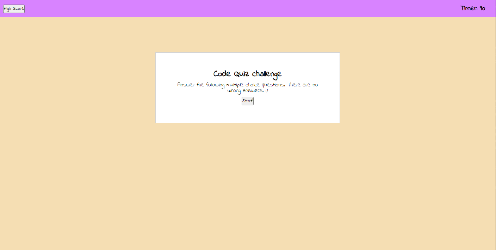
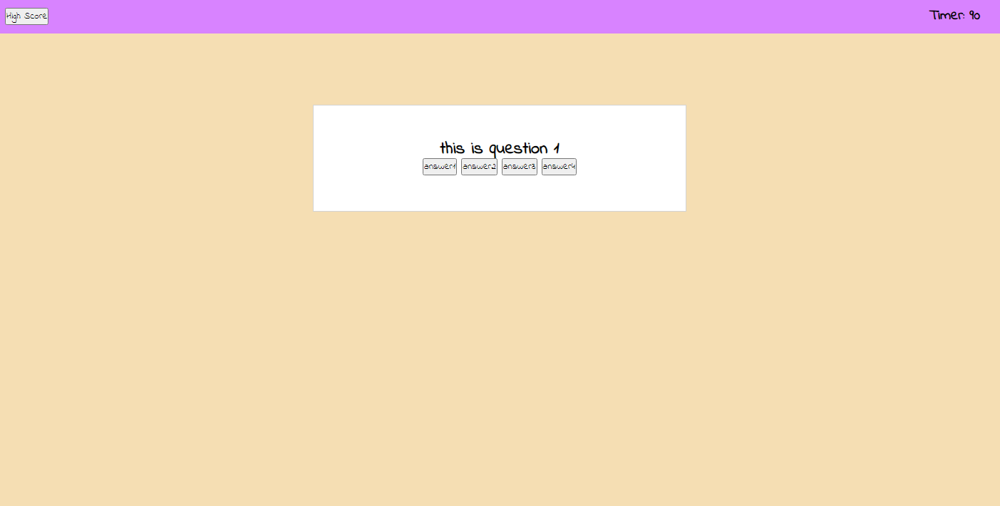
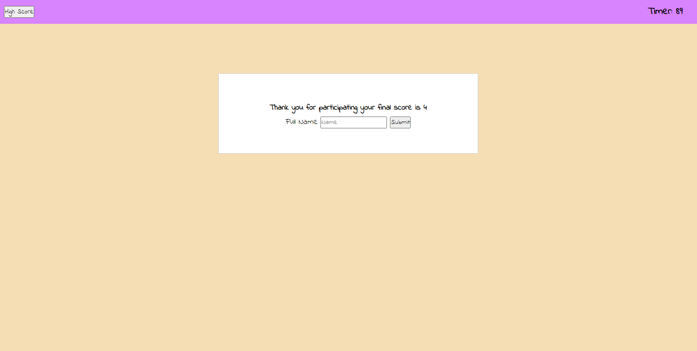
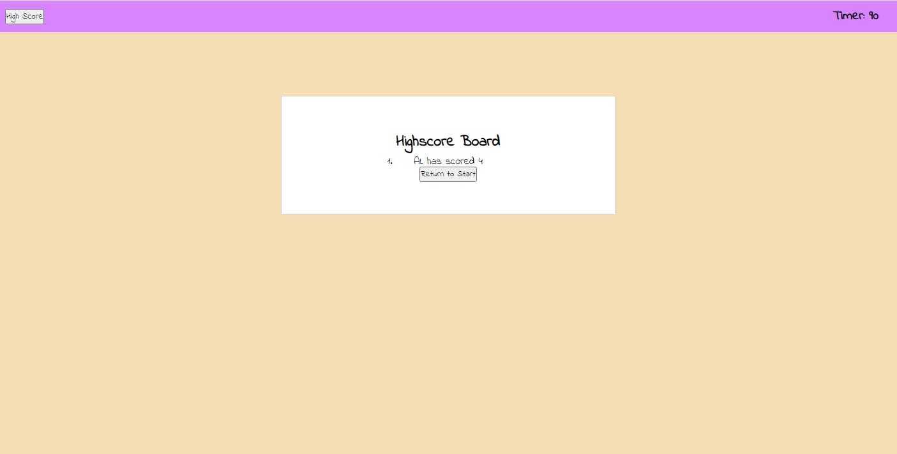

## Week 4 Homework

# Description

The main purpose of this project is to build a multiple choice quiz by utilizing concenpts like setting a timer, accessing local storage, event listeners, and a dymamically written JS to build HTML.

To utilize the concepts above, I will be setting a timer for the quiz, which the timer will decrease in time when the wrong answer choice is chosen and display the submission page once the timer reaches 0. The timer will remain visible throughout the quiz and disappear once the submission page pops up.

To design the quiz, I will build a question bank that the questions and answers will be shown in addition to an actual answer. To effectively display one question at a time, I will write the code so that one question and the respective answers will be shown. In order to check if the answer is correct, I will be comparing the answer choice to the actual answer.

After finishing the quiz, the users should be able enter his or her name and their score will be displayed on the highscore page.

Overall, this project will allow the users to take a quiz with a timer and log their name on the highscore list.

# Installation

To begin with the quiz page, I planned to have a starting page, quiz page, submission page, and a highscore page, which all of these pages will be within a container.

Within the start page, there will be a header and a main section. The header will contain the highscore button and the timer. The contain will contain the starting page text with the quiz title, instructions, and the start button.

On the starting page, I knew a highscore button will be needed to check the highscore. A start button is also required to start the quiz. The start button also serves as a signal to start the timer countdown. Upon pressing the start button, the container will be transitioning from the start page to the quiz page, which a question and four answer choices will be shown.

When designing the question page, I knew that I needed a question, 4 choices, and the correct answer key, which will all be contained inside an array as objects. To move from one question to the next, I figured that I can assign an index and create a for loop, so the questions can proceed.

Furthermore, I knew that upon by choosing the incorrect answer, the timer will decrease and the question page will display the next question. However, if the users choose the correct answer, the timer will not decrease and move on to the next question. In addtion, the user will also get 5 points towards his or her score, which will not be displayed until the submission page. As the user answers the last question, the container will change from the question page to the submit page. In order to do all of the actions listed above, I wrote an extensive if statement with conditions and the results.

While on the submit page, the user's score will be displayed and a form for the user to enter his or her initials below the score. Upon pressing the submit button, the score and the user's initials will be set to the local storage and the high score page will appear.

Finally, on the high score page, all users' scores and initials will be displayed and a "play again" button below the scores. By pressing on the button, the user will be taken back to the start page.

# Usage

This is the starting or landing page of the quiz.

This is the question ppage of the quiz.

This is the name submission page of the quiz.

This is the highscore board.

# DEPLOYED LINK

# Credit

- Google fonts [Google fonts](https://fonts.google.com/)
- Location Function [mdn web docs on location function](https://developer.mozilla.org/en-US/docs/Web/API/Location)

# License

Copyright (c) 2022 Trilogy Education Services, LLC, a 2U, Inc. brand.
